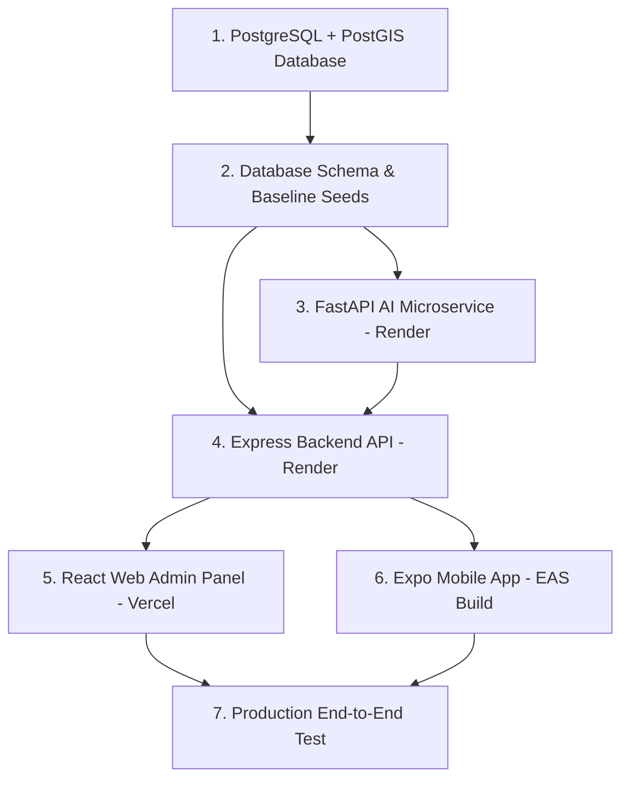

# Sahay Platform — Master Production Deployment Guide

This document provides a comprehensive, step-by-step guide for deploying the **Sahay Civic Intelligence Platform** to production.

---

## 1. Actual Workspace Architecture & Folder Structure

```
sahay/
├── apps/
│   ├── api/                           # Node.js / Express Backend API & Socket.IO
│   │   ├── src/
│   │   │   ├── routes/                # 25+ REST API routes (auth, reports, incidents, admin, revenue, etc.)
│   │   │   ├── middleware/            # Auth, RBAC, and rate limiting middleware
│   │   │   ├── db/                    # PostgreSQL connection pool (pool.ts)
│   │   │   ├── realtime/              # Socket.IO event handler (socket.ts)
│   │   │   ├── utils/                 # Winston logger and utility helpers
│   │   │   └── index.ts               # Express & Socket.IO server entry point
│   │   ├── uploads/                   # Uploaded media storage fallback
│   │   ├── package.json
│   │   └── tsconfig.json
│   │
│   ├── ai-services/                   # Python FastAPI AI Microservice (8 Engines + DINOv2)
│   │   ├── main.py                    # FastAPI application entry point
│   │   ├── dinov2_engine.py           # PyTorch & DINOv2 visual evidence verification engine
│   │   └── requirements.txt           # Python dependencies (FastAPI, uvicorn, torch, openai, etc.)
│   │
│   ├── web/                           # React + Vite Web Admin & Portal Application
│   │   ├── src/
│   │   │   ├── components/            # AdminDashboard.tsx, UserContentManagement, IncidentManagement, etc.
│   │   │   ├── api/                   # Axios API client (client.ts)
│   │   │   └── main.tsx
│   │   ├── vite.config.ts
│   │   └── package.json
│   │
│   └── real_mobile_application/       # React Native / Expo Mobile Application
│       ├── src/
│       │   ├── screens/               # FeedScreen, ReportScreen, DiscoverScreen, IncidentDetailScreen, etc.
│       │   ├── components/            # UserProfileModal, NGOWorkSubmitModal, etc.
│       │   ├── context/               # AuthContext.tsx
│       │   └── api/                   # Axios API client (client.ts)
│       ├── app.json                   # Expo application configuration
│       └── package.json
│
├── infra/
│   ├── db/                            # PostgreSQL Database Scripts
│   │   ├── 001_initial_schema.sql     # PostGIS tables, spatial indices, enum types, trigger functions
│   │   └── 002_seed_bhopal.sql        # Baseline seed data (wards, users, incidents, reports)
│   └── docker/                        # Docker compose infrastructure scripts
│
└── packages/
    └── shared-types/                  # Shared TypeScript interfaces & types
```

---

## 2. Deployable Services Matrix

| Component | Technology | Local Port | Build Command | Start Command | Target Deployment Host |
| :--- | :--- | :--- | :--- | :--- | :--- |
| **Database** | PostgreSQL + PostGIS | `5434` / `5432` | N/A | Managed Instance | **Render PostgreSQL / Supabase / Aiven** |
| **AI Microservice** | Python 3.10 / FastAPI | `8001` | `pip install -r requirements.txt` | `uvicorn main:app --host 0.0.0.0 --port $PORT` | **Render Web Service** |
| **Backend API** | Node.js / Express | `3000` | `npm install && npm run build` | `npm start` (`node dist/index.js`) | **Render Web Service** |
| **Web Admin Panel** | React / Vite | `5173` | `npm run build` (`tsc && vite build`) | Static Hosting | **Vercel Web Hosting** |
| **Mobile Application** | React Native / Expo | `8081` | `eas build --platform android` | Standalone App | **Expo EAS Build (APK / AAB)** |

---

## 3. Dependency-Aware Production Deployment Order



### Order Rationale:
1. **Database First**: Both the Express API and Python AI microservice require an active database connection string (`DATABASE_URL`) on startup to execute connection pooling and schema queries.
2. **AI Microservice Second**: The Express API routes (e.g. `POST /reports`, `POST /admin/verify-image-ai`) communicate directly with the AI microservice endpoint (`AI_SERVICES_URL`).
3. **Backend API Third**: Web and Mobile frontend clients depend directly on the production HTTP & Socket.IO backend gateway URL (`https://<RENDER_API_URL>/api/v1`).
4. **Web Frontend & Mobile App Fourth**: Both client applications are compiled with the live backend URL (`VITE_API_URL` and `EXPO_PUBLIC_API_URL`).

---

## 4. Step-by-Step Deployment Instructions

### Step 1: Managed PostgreSQL + PostGIS Database Setup
1. Create a managed PostgreSQL database instance on Render, Supabase, or Aiven.
2. Connect to the database using `psql` or database manager and enable PostGIS:
   ```sql
   CREATE EXTENSION IF NOT EXISTS postgis;
   ```
3. Execute the schema migration and baseline seed files:
   ```bash
   psql "<PRODUCTION_DATABASE_URL>" -f infra/db/001_initial_schema.sql
   psql "<PRODUCTION_DATABASE_URL>" -f infra/db/002_seed_bhopal.sql
   ```

### Step 2: Deploy AI Microservice to Render
1. Log into **Render Dashboard** -> Select **New Web Service**.
2. Connect your Git repository.
3. Configure settings:
   - **Name**: `sahay-ai-services`
   - **Root Directory**: `apps/ai-services`
   - **Environment**: `Python 3`
   - **Build Command**: `pip install -r requirements.txt`
   - **Start Command**: `uvicorn main:app --host 0.0.0.0 --port $PORT`
4. Add Environment Variables:
   - `NVIDIA_API_KEY`: `<YOUR_NVIDIA_NEMOTRON_API_KEY>`
   - `NVIDIA_MODEL`: `nvidia/llama-3.1-nemotron-ultra-253b-v1`
   - `DATABASE_URL`: `<PRODUCTION_DATABASE_URL>`
5. Deploy and record the service URL (e.g., `https://sahay-ai-services.onrender.com`). Verify health check at `GET /healthz`.

### Step 3: Deploy Backend API to Render
1. In **Render Dashboard** -> Select **New Web Service**.
2. Configure settings:
   - **Name**: `sahay-backend-api`
   - **Root Directory**: `apps/api`
   - **Environment**: `Node`
   - **Build Command**: `npm install && npm run build`
   - **Start Command**: `npm start`
3. Add Environment Variables:
   - `PORT`: `10000` (automatically set by Render)
   - `NODE_ENV`: `production`
   - `DATABASE_URL`: `<PRODUCTION_DATABASE_URL>`
   - `AI_SERVICES_URL`: `https://sahay-ai-services.onrender.com`
   - `JWT_SECRET`: `<RANDOM_STRONG_SECRET>`
   - `CORS_ORIGINS`: `https://sahay-admin.vercel.app`
4. Deploy and record backend URL (e.g., `https://sahay-backend-api.onrender.com`). Verify health check at `GET /healthz`.

### Step 4: Deploy Web Admin Panel to Vercel
1. Log into **Vercel Dashboard** -> Select **Add New Project**.
2. Import repository and select Root Directory `apps/web`.
3. Framework Preset: `Vite`.
4. Add Environment Variable:
   - `VITE_API_URL`: `https://sahay-backend-api.onrender.com/api/v1`
5. Deploy. Verify admin panel accessibility and API communication.

### Step 5: Configure & Build Mobile Application via EAS
1. In `apps/real_mobile_application`, create `eas.json`:
   ```json
   {
     "build": {
       "development": {
         "developmentClient": true,
         "distribution": "internal"
       },
       "preview": {
         "distribution": "internal",
         "android": {
           "buildType": "apk"
         }
       },
       "production": {
         "android": {
           "buildType": "apk"
         },
         "env": {
           "EXPO_PUBLIC_API_URL": "https://sahay-backend-api.onrender.com/api/v1"
         }
       }
     }
   }
   ```
2. Trigger Expo EAS Android build:
   ```bash
   eas build --platform android --profile production
   ```
3. Download generated APK and install on physical Android device for end-to-end testing.

---

## 5. Security Checklist & Production Rules
- [x] **No Secrets Committed**: `.env` and credential files are excluded in `.gitignore`.
- [x] **Server-Side Authorization**: Enforced role checks (`requireRole(['admin'])`) on sensitive backend endpoints.
- [x] **Strict Input Validation**: Zod schemas sanitize all incoming API request bodies.
- [x] **CORS Origin Restricting**: Explicit production origins configured via `CORS_ORIGINS`.
- [x] **HTTPS Enforcement**: Production cloud hosts (Render, Vercel) enforce SSL/TLS encryption for all HTTP and WebSocket connections.
